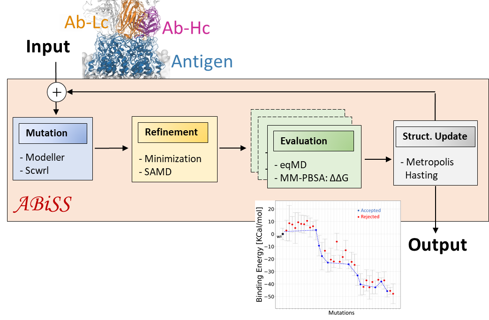

<!-- Centered Logo with Descriptive Alt Text -->
<p align="center">
  
</p>
<div align="center"> 
  <strong> Diving to the bottom of the Binding Energy Landscape </strong>
</div>
<!-- Optional: Add a line break or divider -->

---

# ABiSS - Antibody in Silico Selection

**Design**: Damiano Buratto & Francesco Zonta  
**Author**: Damiano Buratto  
**Email**: damianoburatto@gmail.com  
**Version**: 0.6 (August 2023)  

---

## Description

ABiSS (Antibody in Silico Selection) is a computational tool designed for the selection and design of antibody sequences using molecular dynamics and energy minimization methods. This software is aimed at researchers in the field of computational biology, particularly those working with antibodies and protein-ligand interactions.

### Key Features:
- **Antibody Mutagenesis**: Allows for the creation and analysis of mutant antibody structures.
- **Protein-Protein Interaction (PPI) Calculation**: Handles complex protein-protein interaction simulations and binding free energy evaluations using tools like gmx_MMPBSA.
- **Metropolis Algorithm**: Implements a Metropolis algorithm to explore different conformations of antibody mutants.
- **Multiple Simulation Support**: The program supports parallel processing for computational efficiency, especially useful for high-throughput simulations on clusters.
- **Customizable Workflows**: Provides flexibility in configuring the simulation process using a variety of user-defined parameters.

---

## Architecture
<!-- Centered Architecture picture with Descriptive Alt Text -->
<p align="center">
  
  <br />
  <em> <strong>Figure 1:</strong> Schematic representation of the computational protocol. </em>
</p>

ABiSS is designed to systematically optimize antibody binding affinity by iteratively introducing single or double-point mutations within the CDRs, aiming to reach the bottom of the binding energy (BE) landscape, thereby enhancing antibody-antigen interactions. The workflow of ABiSS is outlined in Figure 1 and follows these key steps:
1.	Mutation: Single or double-point random mutations are introduced at critical positions in the antibody CDRs using Modeller or Scwrl. The pool of critical residues that can be mutated is pre-selected and depends on the specific case.
2.	Refinement: The mutated antibody undergoes a structural relaxation process followed by Simulated Annealing Molecular Dynamics (SAMD) simulations to ensure convergence to an energy minimum after the introduction of a small perturbation (mutation) in the system.
3.	Evaluation: Multiple energy-minimized conformations are sampled in parallel through MD simulations. It has been shown that using multiple short simulations (less than 10ns) is an efficient method for reliable configurational sampling[^1]. The binding affinity of the complex is estimated from these trajectories using Molecular Mechanics Poisson-Boltzmann Surface Area (MMPBSA) calculations. MMPBSA provides a fast and reliable way to estimate BE and consistently rank candidates based on BE.
4.	Structure Update: The Metropolis-Hastings algorithm is used to determine the starting configuration for the next Monte Carlo Markov Chain (MCMC)  iteration. At each iteration, the new configuration can either be Accepted (used as a starting point for the next iteration) or Rejected (the previous configuration is retained). The decision is based on the BE difference between the new and previous configurations, ensuring a progressive improvement in binding affinity while escaping local energy minima by occasionally accepting suboptimal mutations with a controlled probability.

The iteration process continues for a predefined number of cycles or until a threshold number of cumulative mutations is reached, leading to the selection of multiple optimized antibody candidates.
Multiple instances of ABiSS can be run in parallel to ensure the production of a sufficient amount of high-quality antibody candidates.

[^1]: Buratto D, Wan Y, Shi X, Yang G, Zonta F. *In Silico Maturation of a Nanomolar Antibody against the Human CXCR2*. Biomolecules. 2022;12(9):1285. doi:10.3390/biom12091285 [link](https://www.mdpi.com/2218-273X/12/9/1285)
---

## Requirements

Before running ABiSS, ensure you have the following dependencies installed:

- **Gromacs** (for structure file handling and Molecular Dynamics)
- **VMD** (no GUI - for structure file handling )
- **gmx_MMPBSA** https://valdes-tresanco-ms.github.io/gmx_MMPBSA/dev/installation/  
- **Modeller** https://salilab.org/modeller/download_installation.html  
- **Python 3.8 or higher** with Pandas and Numpy
<!-- **Antechamber** (optional, for force field parameterization) -->
<!-- **OpenBabel** (optional, but strongly recommended for molecular format conversions) -->

---

## Installation

1. Clone the repository:
    ```bash
    git clone https://github.com/DamianoBuratto/ABiSS.git
    cd ABiSS
    ```

2. Install required dependencies. You may need to install **Gromacs**, **VMD**, **Modeller**, and **Python** dependencies manually or using a package manager (e.g., `conda`).

3. Set up the environment by ensuring all necessary programs are available in your system's PATH.

---

## Usage

### Running ABiSS:

To run the program, you can use the following command:

```bash
ABiSS_custom.sh -I INPUT.in 
```
where the parameter -I is used to specify the input file pattern. An example of the INPUT file (`INPUT_example.in`) is provided with the code.

You can also restart calculations by passing the -R option along with the path to previously computed settings:

```bash
ABiSS_custom.sh -I INPUT.in -R "RUN1/SETUP_PROGRAM_FILES/abiss_settings.sh"
```

### Workflow
ABiSS follows a structured workflow:

1. Setup and Initialization:
   - The system configuration and setup files are loaded, and directories are created for different cycles.
2. Mutation Cycle:
   - The program iterates through several mutant cycles, applying changes to antibody sequences using the Metropolis algorithm.
3. Position Restraints, Equilibration, and Molecular Dynamics (MD):
   - Position restraints can be generated for the system
   - the structure is equilibrated using NVT and NPT simulations.
   - a new configurational minimum is achieved through Simulated Annealing Molecular dynamics (SAMD)
   - equilibrium MD is performed
4. Energy Calculation:
   - frames from MD are used for interaction calculations to assess binding affinity.
6. Analysis and Output:
   - The final results, including energy calculations and mutant configurations, are saved and made available for further analysis.

<!-- ### Example Usage
#### Generating a New Mutation:
```bash
MakeNewMutant_Modeller.py "${complex_FILE}.pdb" -s "${SystemName}" -o "./Mutant${SEQUENCE}" \
    -rl ${TargetResidueList} -rw ${resid_be_decomp_files[*]} -v
```
#### Running MD Simulations:
```bash
run_md_for_every_cycle "system_equil.gro" "${topName}" "${tprFILE}" "${trjNAME}"
```
-->


---

## License
This project is licensed under the GPL-3.0 License - see the LICENSE file for details.

---

## Acknowledgements
ABiSS was developed by Damiano Buratto and Francesco Zonta with the precious contributions and suggestions from Prof. Zhous's group at IQB, ZJU. 
The software is based on various computational biology tools, including [Gromacs](https://www.gromacs.org/), [VMD](https://www.ks.uiuc.edu/Research/vmd/), [Modeller](https://salilab.org/modeller/), and [Chimera](https://www.cgl.ucsf.edu/chimera/).

If you use our software, please cite the following paper [paper](https://www.mdpi.com/2218-273X/12/9/1285)


